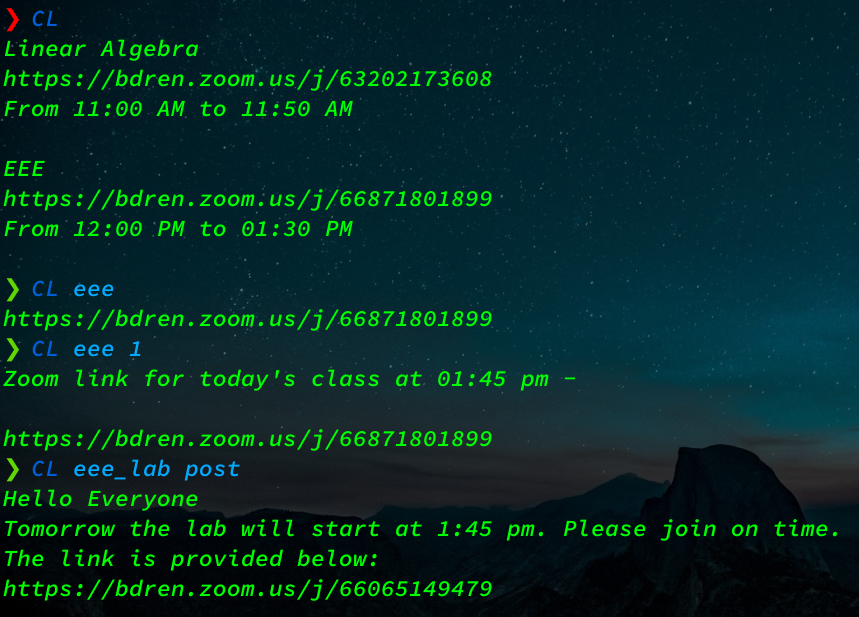

# What is this
This is for those doing online classes and the zoomer teachers are constantly changing the zoom link so you have to go to the classroom and fetch it for almost every class

With this cli tool the link will be automatically fetched from your classroom


# Installation
- `git clone https://github.com/gr523/zoomer.git clink`
- Install pip (for python3)
- Install the google authentication libraries

  `pip install --upgrade google-api-python-client google-auth-httplib2 google-auth-oauthlib`
- [Create a google client id](https://developers.google.com/workspace/guides/create-project) and enable classroom api
- [Create credential](https://developers.google.com/workspace/guides/create-credentials) and download it as credentials.json
- It takes about 5 minutes to set up but its kinda tedious,so I have created a  [public client id](https://drive.google.com/file/d/1w5SAoNxBRKrdYYmWM0-jWIAoVCD-YHbU) from a dummy google account,so you can test it out right away.Note that client ids have bandwith limits,if other people are using it you will get less speed so if you'r gonna use this tool create your own clinet id

# Editing your courses and routine
- Refer to aliases.py to see how to set up your courses 
- Refer to datatypes.py to see examples on how to create your routine
- The routines are in .py file because of speed advantages you can use classlist.py if you want to use csv files


# Easy way to use
create a file named CL (or your prefered name) with these content
```bash
#!/bin/sh
cd "$HOME/clink"
# or wherever you cloned the project
python3 main.py $@ 
```
```
chmod +x CL
cd /usr/bin
sudo ln -sf "$HOME/clink/CL"
```

# Usage
- To get Links of todays class according to the routine
  just run `CL` with no arguments
- Get Links of a specific class

  `CL classAlias`
  
- Get the latest post of a class
 
  `CL classAlias post`

- Get the raw json file for recent posts

  `CL classAlias raw`

- Get Ids for all your courses

  `CL 1`

  A file named 'FetchedCourseIds' will be created in the project directory

- To use a differnt google account remove token.json from project folder,edit your courses and routines, run the program and sign in to that account 

- Screenshot of these examples


